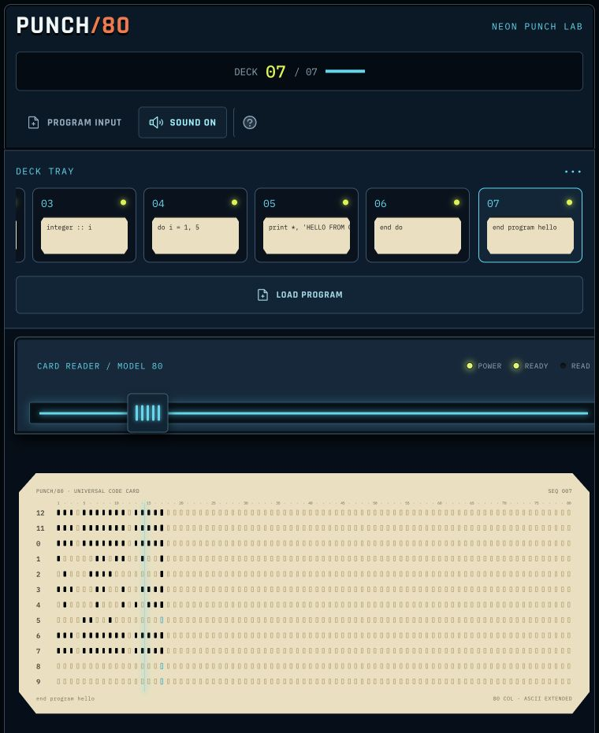
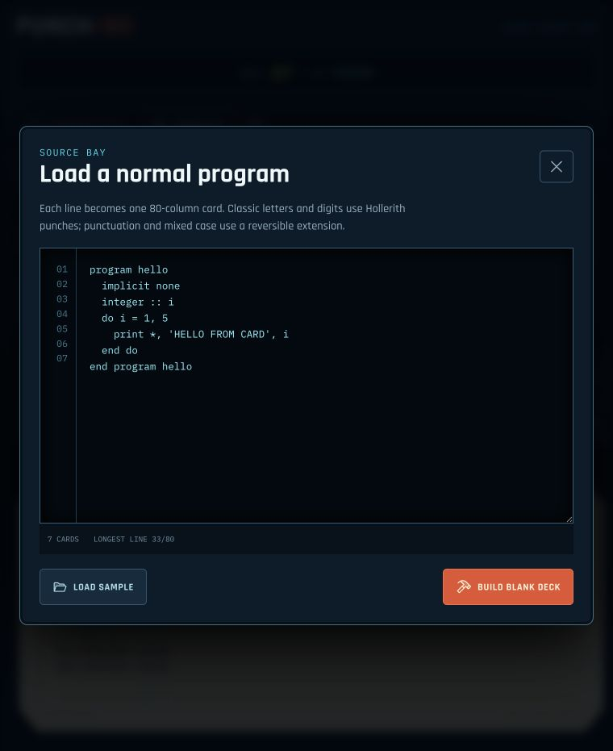
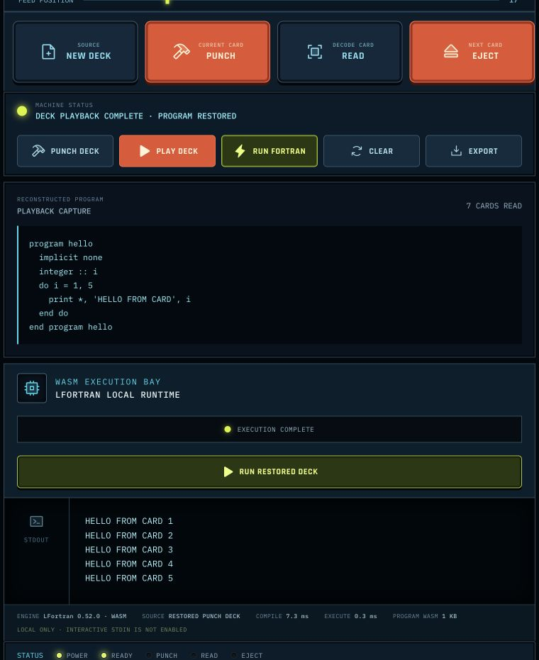

# PUNCH/80

> The future of computing, as imagined by a very optimistic mainframe in 1969.

**PUNCH/80** turns ordinary source code into a stack of animated 80-column punch cards, feeds them back through a virtual reader, and can even compile and run Fortran in your browser with LFortran WebAssembly.

No mainframe, necktie, or climate-controlled computer room required.

**Are those holes actually doing anything?** Yes—with a few historically inspired liberties. Read [How the virtual punch cards work](docs/punch-card-model.md) for the data structure, encoding rules, reader path, and accuracy notes.



## Insert card. Press buttons. Make science.

- **Write normally** — paste a multi-line program instead of memorizing hole patterns.
- **Punch a deck** — every source line becomes an interactive 80-column card.
- **Run the machinery** — load, punch, scan, read, and eject cards with satisfyingly unnecessary animation.
- **Turn up the clatter** — synthesized mechanical sounds make your laptop approximately 73% more mainframe.
- **Edit the holes** — click individual punch positions when you feel like debugging at the speed of 1957.
- **Play it back** — feed the whole deck through the reader and reconstruct the original source.
- **Run Fortran locally** — compile the restored deck with LFortran WASM and inspect stdout, timings, diagnostics, and generated program size.
- **Keep the evidence** — export the card deck as JSON.

## A brief tour of the machinery

| Load a perfectly ordinary program | Compile the restored deck in the WASM bay |
| --- | --- |
|  |  |

## Wake the machine

You will need a recent Node.js release. Then pull the big green lever:

```bash
npm install
npm run dev
```

Open [http://127.0.0.1:5173](http://127.0.0.1:5173), switch on your imaginary vacuum tubes, and begin.

For a production build:

```bash
npm run build
```

The deploy-ready files land in `dist/`. A `netlify.toml` is included for Netlify deployments.

## Operator's quick-start card

1. Select **PROGRAM INPUT** and paste a program, or load the sample.
2. Build the deck and inspect the holes. They are tiny, but they have excellent posture.
3. Select **PUNCH DECK** to animate the complete stack.
4. Select **PLAY DECK** to read the cards back into source code.
5. Select **RUN FORTRAN** and watch a modern browser impersonate a computer room.

Try the included specimen:

```fortran
program hello
  implicit none
  integer :: i
  do i = 1, 5
    print *, 'HELLO FROM CARD', i
  end do
end program hello
```

## Under the Bakelite hood

Each source line becomes one 80-column card. Letters and digits use classic Hollerith-style patterns. Other printable characters use a reversible extension, allowing mixed-case source and punctuation to survive a complete punch/read round trip.

For the complete technical tour, open [How the virtual punch cards work](docs/punch-card-model.md).

Fortran source is compiled inside the browser by the bundled LFortran compiler. It emits a second WebAssembly program, which PUNCH/80 executes through a small WASI bridge while capturing standard output. The compiler is loaded only after **RUN FORTRAN** is selected, and source code never leaves the browser.

The interface includes speed controls and reduced-motion support, because even fictional electromechanical equipment should respect its operator.

## Fine print from the computer room

- Source lines are limited to 80 characters. The card has spoken.
- Decks are limited to 50 cards.
- Interactive Fortran stdin (`read`) is not implemented yet.
- Some advanced or legacy Fortran may not compile while LFortran continues to evolve.
- The first compiler run loads a roughly 22 MB WebAssembly asset. Good things come to those who watch blinking lights.

## LFortran

The bundled browser runtime is **LFortran 0.52.0**, commit `b5e05bd3a`, matching the build used by the official LFortran browser frontend when this project was created. Runtime provenance lives in `public/lfortran/runtime.json`.

LFortran is distributed under the BSD license; its license is included at `public/lfortran/LICENSE`.

---

Built for curious programmers, retro-computing romantics, and anyone who believes compilation should make a satisfying **ka-chunk**.
